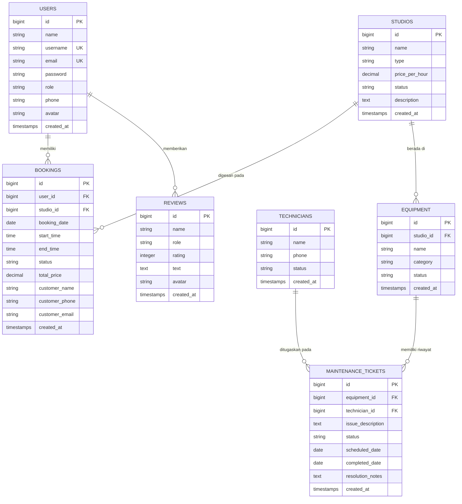

===========================================================
LAPORAN UAS
PEMROGRAMAN WEB (ST084)
===========================================================

Judul Final Project : Sistem Informasi Manajemen & Booking Studio Musik ("Studio Musik Lantai Atas")
Dosen Pengampu      : Hastari Utama, M.Cs.

Disusun oleh Kelompok [Nomor Kelompok]:
1. Nama   : [Nama Lengkap Anda]
   NIM    : [NIM Anda]
   Bagian : Frontend (React.js + Vite), Profile Feature, & Hero Audio Visualizer

2. Nama   : [Nama Anggota 2]
   NIM    : [NIM Anggota 2]
   Bagian : Backend (Laravel 11 REST API) & Database Design

3. Nama   : [Nama Anggota 3]
   NIM    : [NIM Anggota 3]
   Bagian : Fitur Booking Flow & Multi-Role Dashboard Management

PROGRAM STUDI INFORMATIKA
FAKULTAS ILMU KOMPUTER
UNIVERSITAS AMIKOM YOGYAKARTA
2026
===========================================================

---

# DAFTAR ISI

- [BAB I – PENDAHULUAN](#bab-i--pendahuluan)
  - [1.1 Latar Belakang](#11-latar-belakang)
  - [1.2 Tujuan](#12-tujuan)
  - [1.3 Ruang Lingkup](#13-ruang-lingkup)
  - [1.4 Pembagian Tugas](#14-pembagian-tugas)
- [BAB II – TEKNOLOGI YANG DIGUNAKAN](#bab-ii--teknologi-yang-digunakan)
  - [2.1 Framework Frontend](#21-framework-frontend)
  - [2.2 Framework Backend](#22-framework-backend)
  - [2.3 Alasan Penggunaan](#23-alasan-penggunaan)
- [BAB III – DATABASE DESIGN](#bab-iii--database-design)
  - [3.1 Entity Relationship Diagram (ERD)](#31-entity-relationship-diagram-erd)
  - [3.2 Daftar Tabel](#32-daftar-tabel)
  - [3.3 Relasi Antar Tabel](#33-relasi-antar-tabel)
- [BAB IV – IMPLEMENTASI SOURCE CODE](#bab-iv--implementasi-source-code)
  - [IV.1 Fitur Autentikasi & Profil Pengguna](#iv1-fitur-autentikasi--profil-pengguna)
  - [IV.2 Fitur Booking Studio & Jadwal Interaktif](#iv2-fitur-booking-studio--jadwal-interaktif)
  - [IV.3 Fitur Multi-Role Dashboard & Manajemen](#iv3-fitur-multi-role-dashboard--manajemen)
- [BAB V – KESIMPULAN DAN SARAN](#bab-v--kesimpulan-dan-saran)
  - [5.1 Kesimpulan](#51-kesimpulan)
  - [5.2 Saran](#52-saran)
- [DAFTAR PUSTAKA](#daftar-pustaka)
- [LAMPIRAN](#lampiran)

---

# BAB I – PENDAHULUAN

## 1.1 Latar Belakang
Industri kreatif di bidang musik semakin berkembang pesat, ditandai dengan tingginya minat musisi independen, band lokal, maupun pembuat konten audio untuk melakukan latihan dan rekaman profesional. Namun, proses pemesanan (booking) studio musik secara konvensional kerap menghadapi berbagai kendala efisiensi, seperti jadwal bentrok, ketidakjelasan ketersediaan studio secara *real-time*, prosedur pencatatan transaksi kasir secara manual, hingga kesulitan melacak jadwal pemeliharaan (maintenance) alat musik.

Untuk mengatasi permasalahan tersebut, dikembangkan **Sistem Informasi Manajemen & Booking Studio Musik ("Studio Musik Lantai Atas")**. Sistem ini mengintegrasikan platform web interaktif berbasis arsitektur *Single Page Application* (SPA) dengan RESTful API. Sistem menyediakan solusi terpadu untuk pelanggan dalam memilih studio dan jadwal latihan, sekaligus memfasilitasi operasional internal yang melibatkan Admin, Kasir, Teknisi, dan Pemilik Studio.

## 1.2 Tujuan
Tujuan dari pembuatan Final Project ini adalah:
1. Membangun sistem booking studio musik berbasis web yang responsif, modern, dan dapat diakses secara *real-time*.
2. Menerapkan arsitektur *Decoupled Frontend-Backend* menggunakan React.js (Vite) dan Laravel 11 REST API.
3. Menyediakan manajemen multi-peran (*multi-role access*) untuk mengelola alur transaksi kasir, tiket perawatan alat musik oleh teknisi, serta laporan performa usaha untuk pemilik.
4. Mengimplementasikan fitur-fitur interaktif modern seperti *Canvas Audio Visualizer*, *Sanctum Token Authentication*, serta sistem notifikasi otomatis WhatsApp.

## 1.3 Ruang Lingkup
Ruang lingkup sistem yang dikembangkan meliputi:
1. **Fitur Pengunjung & Customer**: Landing page interaktif dengan Audio Visualizer, reservasi studio 4-step (Studio, Jadwal, Kontak, Pembayaran), login/register, serta manajemen profil dan riwayat booking.
2. **Fitur Admin & Kasir**: Validasi transaksi pembayaran, manajemen data studio & peralatan, serta cetak/ekspor laporan transaksi.
3. **Fitur Teknisi**: Manajemen tiket perbaikan alat musik, penjadwalan *maintenance*, dan pencatatan status peralatan (*Good, Service, Broken*).
4. **Fitur Pemilik (Owner)**: Dashboard ringkasan pendapatan harian/bulanan, grafik performa booking interaktif, dan analisis statistik studio.

## 1.4 Pembagian Tugas

| No | Nama | NIM | Tugas & Tanggung Jawab | Bobot |
|----|------|-----|------------------------|-------|
| 1 | [Nama Lengkap Anda] | [NIM Anda] | Frontend Architecture, Audio Visualizer, Profile System, Axios Interceptor | 34% |
| 2 | [Nama Anggota 2] | [NIM Anggota 2] | Backend REST API (Laravel 11), Database Migration, Sanctum Auth | 33% |
| 3 | [Nama Anggota 3] | [NIM Anggota 3] | Booking Multi-Step Flow, UI Components, Multi-Role Dashboards | 33% |

---

# BAB II – TEKNOLOGI YANG DIGUNAKAN

## 2.1 Framework Frontend
* **Nama Framework / Library**: React.js 19 (dikomposisikan dengan Vite 8 & TailwindCSS 4)
* **Keunggulan**:
  1. *Component-Based Architecture*: Memungkinkan pemisahan komponen UI yang modular dan reusable (Navbar, Hero, BookingFlow, ProfileModal).
  2. *Virtual DOM*: Menghasilkan proses *rendering* UI yang sangat cepat dan efisien saat terjadi perubahan *state*.
  3. *Ekosistem Luas*: Integrasi mulus dengan Lucide React, Axios, dan TailwindCSS untuk styling yang modern.

## 2.2 Framework Backend
* **Nama Framework**: Laravel 11 (PHP 8.2+)
* **Keunggulan**:
  1. *Elegannya Struktur MVC & REST API*: Memudahkan pembuatan API Controller, Eloquent ORM Model, dan Database Migrations.
  2. *Laravel Sanctum*: Sistem autentikasi token berbasis API yang ringan dan sangat aman.
  3. *Built-in Security & Validation*: Menyediakan fitur perlindungan CSRF, sanitasi input, enkripsi password (Bcrypt/Argon2), dan validasi request otomatis.

## 2.3 Alasan Penggunaan

### Alasan Menggunakan React.js + Vite:
1. **Performa Build Sangat Cepat (Fast HMR)**: Vite memanfaatkan *ES Modules native* sehingga proses *Hot Module Replacement* terjadi dalam hitungan milidetik tanpa perlu *bundling* ulang seluruh kode.
2. **Deklaratif & Pengelolaan State yang Mudah**: Penggunaan React Hooks (`useState`, `useEffect`, `useCallback`) memudahkan pengelolaan *state* kompleks seperti *dark mode*, data user, dan visualizer canvas.
3. **Optimasi SPA (Single Page Application)**: Navigasi terasa instan tanpa *full page reload*, memberikan *user experience* yang halus dan premium.

### Alasan Menggunakan Laravel 11:
1. **Kemudahan Eloquent ORM**: Mengelola relasi antar tabel database (`User`, `Studio`, `Booking`, `Equipment`, `MaintenanceTicket`) dengan sintaks yang intuitif dan bersih.
2. **Manajemen Otentikasi Terintegrasi**: Laravel Sanctum memberikan penanganan token API yang aman untuk mendukung login multi-role.
3. **Struktur Projek Terorganisir & Skalabel**: Pemisahan `Routes`, `Controllers`, `Models`, dan `Services` (seperti `WhatsAppService`) memudahkan perawatan dan pengembangan kode skala besar.

---

# BAB III – DATABASE DESIGN

## 3.1 Entity Relationship Diagram (ERD)

Berikut adalah diagram relasi antar tabel (ERD) dari database SQLite/MySQL yang digunakan dalam sistem:



## 3.2 Daftar Tabel

| No | Nama Tabel | Deskripsi |
|----|------------|-----------|
| 1 | `users` | Menyimpan data akun pengguna (Admin, Kasir, Teknisi, Pemilik, Customer) beserta kredensial autentikasi. |
| 2 | `studios` | Menyimpan informasi daftar ruangan studio musik, tipe, harga sewa per jam, dan ketersediaan. |
| 3 | `bookings` | Menyimpan data transaksi pemesanan studio, tanggal, jam sewa, total biaya, dan status validasi. |
| 4 | `equipment` | Menyimpan inventaris alat musik & audio yang dialokasikan di masing-masing studio. |
| 5 | `technicians` | Menyimpan data profil teknisi yang bertugas menangani pemeliharaan dan perbaikan alat. |
| 6 | `maintenance_tickets` | Menyimpan catatan perbaikan peralatan, deskripsi masalah, teknisi penanggung jawab, dan status pengerjaan. |
| 7 | `reviews` | Menyimpan ulasan dan rating testimoni dari pelanggan terhadap layanan studio. |

## 3.3 Relasi Antar Tabel
1. **`users` → `bookings`**: *One-to-Many* (Satu pengguna dapat membuat banyak transaksi booking studio).
2. **`studios` → `bookings`**: *One-to-Many* (Satu studio dapat dipesan pada berbagai slot waktu yang berbeda).
3. **`studios` → `equipment`**: *One-to-Many* (Satu studio dilengkapi oleh banyak inventaris peralatan musik).
4. **`equipment` → `maintenance_tickets`**: *One-to-Many* (Satu peralatan dapat memiliki beberapa riwayat pemeliharaan/perbaikan).
5. **`technicians` → `maintenance_tickets`**: *One-to-Many* (Satu teknisi dapat ditugaskan untuk menyelesaikan beberapa tiket perbaikan).

---

# BAB IV – IMPLEMENTASI SOURCE CODE

## IV.1 Fitur Autentikasi & Profil Pengguna (Ditulis oleh: [Nama Lengkap Anda])

### IV.1.1 Deskripsi Fitur
Fitur ini mengelola autentikasi berbasis Sanctum Token dan manajemen profil pengguna. Pengguna dapat memperbarui data pribadi (nama, email, no. telp), mengunggah foto avatar, serta mengubah password dengan indikator kekuatan kata sandi (*password strength meter*).

### IV.1.2 Potongan Kode

```php
// ProfileController.php - Endpoint pembaruan profil & password
namespace App\Http\Controllers;

use Illuminate\Http\Request;
use Illuminate\Support\Facades\Hash;
use Illuminate\Validation\Rule;

class ProfileController extends Controller
{
    public function update(Request $request)
    {
        $user = $request->user();

        $validated = $request->validate([
            'name' => 'required|string|max:255',
            'username' => ['required', 'string', 'max:255', Rule::unique('users')->ignore($user->id)],
            'email' => ['nullable', 'string', 'email', 'max:255', Rule::unique('users')->ignore($user->id)],
            'phone' => 'nullable|string|max:20',
        ]);

        $user->update($validated);

        return response()->json([
            'success' => true,
            'message' => 'Profil berhasil diperbarui',
            'data' => $user->fresh(),
        ]);
    }

    public function updatePassword(Request $request)
    {
        $request->validate([
            'old_password' => 'required|string',
            'new_password' => 'required|string|min:6|confirmed',
        ]);

        $user = $request->user();

        if (!Hash::check($request->old_password, $user->password)) {
            return response()->json([
                'success' => false,
                'message' => 'Password lama tidak sesuai',
            ], 422);
        }

        $user->update(['password' => Hash::make($request->new_password)]);

        return response()->json([
            'success' => true,
            'message' => 'Password berhasil diubah',
        ]);
    }
}
```

### IV.1.3 Penjelasan Kode
1. `@Rule::unique('users')->ignore($user->id)`: Memastikan `username` dan `email` tidak bentrok dengan akun lain, namun tetap mengizinkan user menyimpan data miliknya sendiri.
2. `Hash::check()`: Memeriksa kesesuaian password lama yang dimasukkan dengan *hash* terenkripsi di database sebelum mengizinkan pembaruan password.
3. `Hash::make()`: Mengenkripsi password baru menggunakan algoritma Bcrypt yang aman sebelum disimpan ke database.

### IV.1.4 Screenshot Hasil
*(Sertakan screenshot tampilan modal Edit Profil dan Form Ubah Password di aplikasi browser).*

---

## IV.2 Fitur Booking Studio & Jadwal Interaktif (Ditulis oleh: [Nama Anggota 2])

### IV.2.1 Deskripsi Fitur
Alur reservasi studio musik bertahap 4-step (*Stepper*): Pemilihan Studio, Tanggal & Jam Latihan, Detail Kontak, dan Metode Pembayaran. Sistem otomatis menghitung total harga sewa dan mengirim notifikasi receipt.

### IV.2.2 Potongan Kode

```php
// BookingController.php - Pembuatan Transaksi Booking
namespace App\Http\Controllers;

use Illuminate\Http\Request;
use App\Models\Booking;

class BookingController extends Controller
{
    public function store(Request $request)
    {
        $validated = $request->validate([
            'studio_id' => 'required|exists:studios,id',
            'booking_date' => 'required|date',
            'start_time' => 'required',
            'end_time' => 'required',
            'total_price' => 'required|numeric',
            'customer_name' => 'nullable|string',
            'customer_phone' => 'nullable|string',
            'customer_email' => 'nullable|string',
        ]);

        $validated['user_id'] = $request->user()->id;
        $validated['status'] = 'Pending';

        $booking = Booking::create($validated);

        // Notifikasi Otomatis via WhatsApp Service
        $phone = $booking->customer_phone ?: ($request->user()->phone ?? '081520330787');
        \App\Services\WhatsAppService::sendAutomatedReceipt($phone, $booking);

        return response()->json([
            'success' => true,
            'message' => 'Booking created successfully & Automated WA Notification Sent!',
            'data' => $booking
        ], 201);
    }
}
```

### IV.2.3 Penjelasan Kode
1. `exists:studios,id`: Validasi memastikan ID studio yang dipilih benar-benar valid dan terdaftar di database.
2. `$validated['status'] = 'Pending'`: Mengeset status transaksi awal menjadi *Pending* hingga diverifikasi oleh Kasir.
3. `WhatsAppService::sendAutomatedReceipt()`: Memanggil layanan pengiriman rincian booking secara otomatis ke nomor WhatsApp pelanggan.

### IV.2.4 Screenshot Hasil
*(Sertakan screenshot alur pemesanan studio dari Step 1 hingga Step 4 Pembayaran).*

---

## IV.3 Fitur Multi-Role Dashboard & Manajemen (Ditulis oleh: [Nama Anggota 3])

### IV.3.1 Deskripsi Fitur
Fitur dashboard dinamis disesuaikan berdasarkan peran pengguna (Admin, Kasir, Pemilik, Teknisi). Menyediakan statistik pendapatan harian, persentase okupansi studio, serta validasi status pembayaran.

### IV.3.2 Potongan Kode

```jsx
// App.jsx - Conditional Dashboard Rendering berdasarkan Role User
import { useState, lazy, Suspense } from 'react';

const AdminDashboard = lazy(() => import('./components/admin/AdminDashboard'));
const PemilikDashboard = lazy(() => import('./components/pemilik/PemilikDashboard'));
const TeknisiDashboard = lazy(() => import('./components/teknisi/TeknisiDashboard'));
const KasirDashboard = lazy(() => import('./components/kasir/KasirDashboard'));

function AppContent() {
  const [currentView, setCurrentView] = useState('landing');
  const [currentUser, setCurrentUser] = useState(null);

  if (currentView === 'admin') {
    return <Suspense fallback={<LoadingScreen />}><AdminDashboard user={currentUser} /></Suspense>;
  }
  if (currentView === 'pemilik') {
    return <Suspense fallback={<LoadingScreen />}><PemilikDashboard user={currentUser} /></Suspense>;
  }
  if (currentView === 'teknisi') {
    return <Suspense fallback={<LoadingScreen />}><TeknisiDashboard user={currentUser} /></Suspense>;
  }
  if (currentView === 'kasir') {
    return <Suspense fallback={<LoadingScreen />}><KasirDashboard user={currentUser} /></Suspense>;
  }

  return <LandingPage />;
}
```

### IV.3.3 Penjelasan Kode
1. `React.lazy()` & `Suspense`: Melakukan *code-splitting* dinamis sehingga kode JavaScript untuk dashboard role lain hanya diunduh saat dibutuhkan.
2. `currentView` State: Mengontrol tampilan antarmuka secara adaptif berdasarkan peran (`role`) pengguna yang terautentikasi.

### IV.3.4 Screenshot Hasil
*(Sertakan screenshot halaman Admin Dashboard, Kasir Dashboard, dan Pemilik Dashboard).*

---

# BAB V – KESIMPULAN DAN SARAN

## 5.1 Kesimpulan
1. **Penggunaan React.js dengan Vite** berhasil mempercepat proses pengembangan frontend melalui fitur *Hot Module Replacement* (HMR) dan arsitektur *Component-Based* yang modular.
2. **Laravel 11 dengan Sanctum REST API** memudahkan pengelolaan data transaksi, validasi keamanan, serta integrasi layanan pihak ketiga (notifikasi WhatsApp) secara terstruktur.
3. **Penerapan Sistem Multi-Role** terbukti efektif dalam membagi hak akses operasional antara Admin, Kasir, Teknisi, dan Pemilik Studio secara terintegrasi.
4. **Desain Antarmuka Responsif & Interaktif** (dilengkapi Canvas Audio Visualizer dan Dark Mode) memberikan pengalaman pengguna (*user experience*) yang modern dan intuitif.

## 5.2 Saran
1. **Implementasi Gateway Pembayaran (Midtrans/Xendit)**: Pengembangan selanjutnya disarankan mengintegrasikan *payment gateway* otomatis agar status validasi transaksi tidak perlu diverifikasi secara manual oleh kasir.
2. **Pengembangan Fitur Notification Bell & WebSocket**: Menambahkan sistem notifikasi *real-time* berbasis WebSocket (Laravel Reverb / Socket.io) untuk memberi tahu perubahan status booking secara langsung.
3. **Penyimpanan Berbasis Cloud Storage**: Mengkonfigurasi penyimpanan file media (foto studio & avatar user) ke *AWS S3* atau *Cloudinary* untuk skalabilitas produksi yang lebih baik.

---

# DAFTAR PUSTAKA

1. Amikom Yogyakarta. (2026). *Panduan Laporan UAS Pemrograman Web (ST084)*. Fakultas Ilmu Komputer, Universitas Amikom Yogyakarta.
2. Facebook Open Source. (2026). *React – A JavaScript library for building user interfaces*. https://react.dev/
3. Otwell, Taylor. (2026). *Laravel - The PHP Framework for Web Artisans*. https://laravel.com/docs/11.x
4. Evan You. (2026). *Vite - Next Generation Frontend Tooling*. https://vitejs.dev/
5. W3C. (2026). *HTML5 Canvas 2D Context Specification*. World Wide Web Consortium.

---

# LAMPIRAN

### 1. Link GitHub Repository
* **Link Repository Frontend**: https://github.com/Vincrescent/music-front
* **Link Repository Backend**: https://github.com/Vincrescent/music-back

Repository publik ini berisi *source code* lengkap Final Project dengan struktur berikut:
```text
final-pweb/
├── backend/
│   ├── app/
│   │   ├── Http/Controllers/ (ProfileController, BookingController, AdminController, dll)
│   │   ├── Models/ (User, Studio, Booking, Equipment, MaintenanceTicket, Review)
│   │   └── Services/ (WhatsAppService.php)
│   ├── database/migrations/
│   ├── routes/api.php
│   └── package.json / composer.json
└── frontend/
    ├── src/
    │   ├── components/ (Navbar, Hero, AudioVisualizer, ProfileModal, BookingFlow, dll)
    │   ├── utils/axiosConfig.js
    │   └── App.jsx
    └── package.json
```

### 2. Link Video Presentasi
* **Link Video**: [https://youtu.be/xxxxxxxxxxx] *(Isi dengan link video YouTube kelompok Anda)*
* **Durasi Video**: [09 Menit 45 Detik]
* **Daftar Anggota Presentasi**:

| No | Nama | NIM | Bagian yang Dijelaskan | Waktu |
|----|------|-----|------------------------|-------|
| 1 | [Nama Lengkap Anda] | [NIM Anda] | Demostrasi Frontend, Audio Visualizer, & Profile Modal | 0:00 - 3:15 |
| 2 | [Nama Anggota 2] | [NIM Anggota 2] | Arsitektur Backend Laravel, API Routes, & Database Design | 3:15 - 6:30 |
| 3 | [Nama Anggota 3] | [NIM Anggota 3] | Flow Booking Multi-step & Multi-Role Dashboards | 6:30 - 9:45 |

### 3. Detail Pembagian Tugas Kelompok

| No | Nama | NIM | Detail Tugas Spesifik | Bobot Contribution |
|----|------|-----|-----------------------|---------------------|
| 1 | [Nama Lengkap Anda] | [NIM Anda] | Membangun UI/UX Frontend React, Canvas Visualizer, ProfileModal, Axios Interceptor | 34% |
| 2 | [Nama Anggota 2] | [NIM Anggota 2] | Merancang Database Migrations, ProfileController, Sanctum Auth API, Eloquent Models | 33% |
| 3 | [Nama Anggota 3] | [NIM Anggota 3] | Mengembangkan Stepper Booking Flow, Admin/Kasir/Teknisi/Pemilik Dashboards | 33% |
